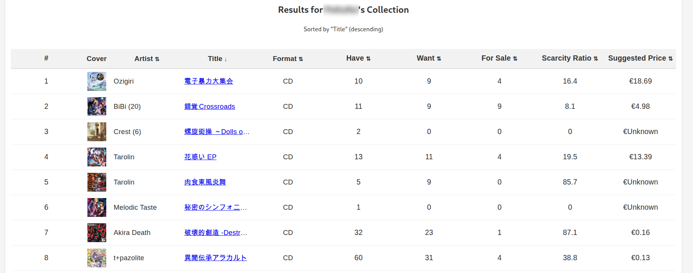

# Discogs Wanted Sorter 💿

A tool that helps you discover the most sought-after records in your Discogs collection.

## What is Discogs Wanted Sorter? 🔍

The Discogs Wanted Sorter can analyze your record collection to identify which items might be the most valuable or rare. It also calculates a "scarcity ratio" based on:

- 👀 Want count (how many people want the record)
- 🧩 Have count (how many people already own it)
- 🏪 For sale count (how many copies are currently available)

The column "Suggested Price" gives the Discogs suggested price assuming your record is "Very Good".



## The Scarcity Formula ✨

The scarcity ratio is calculated using this formula:

```
ScarcityRatio = (WantCount / (HaveCount + 100)) * (1 / (NumForSale + 1)) * 1000
```

Records with higher ratios represent items that are in high demand but relatively hard to find.

## Getting Started 🚀

### Installation

1. Install dependencies:
   ```
   npm install
   ```

2. Start the application:
   ```
   npm start
   ```

3. Open your browser and navigate to:
   ```
   http://localhost:7341
   ```

### Discogs API Token

You'll need a Discogs API token to use this application:

1. Create a Discogs account if you don't have one: https://www.discogs.com/users/create
2. Generate a personal access token at: https://www.discogs.com/settings/developers
3. Enter your token in the application when prompted

## Copyleft 🄯

This project is freely available for anyone to use, modify, and share. Feel free to adapt it to your needs and share your improvements with others.